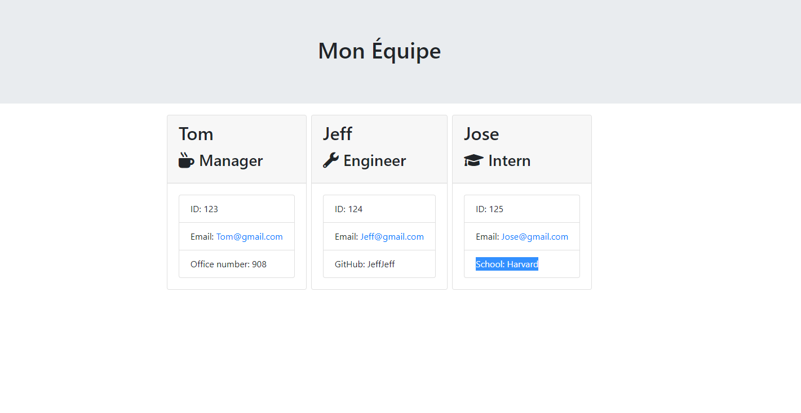
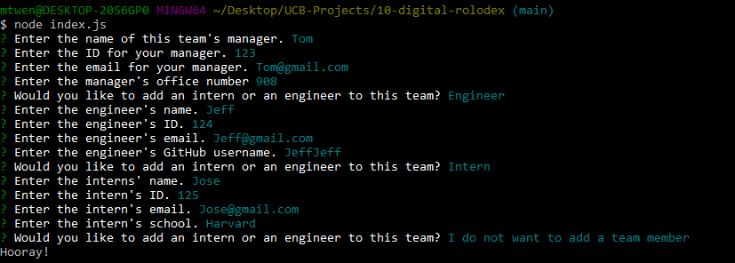
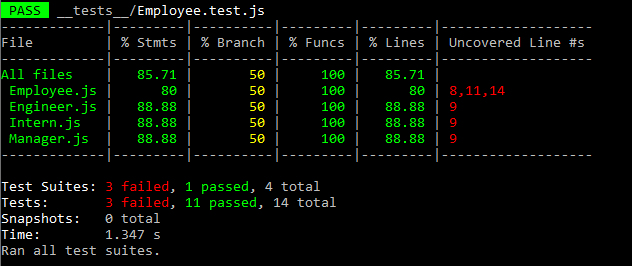

# "Digital Rolodex"

## Table of Contents

- [Description](#description)
- [Technologies](#technologies-used)
- [Usage](#usage)
- [User Information](#user-information)
- [Credits](#credits)
- [License](#license)

## Description

A console interfaced application that allows a user to create contact cards for employees. Teams can be created around a manager, and then teammembers like engineers and interns can be added to that team. After answering all the prompts for team members' information a slick html page is created with info cards for each team member.

## Technologies Used

- HTML
- CSS
- Bootstrap
- Javascript
- Node.js
- Inquirer
- Jest
- JSON

## Usage

### Website Demo

[Video Demonstation of Application](https://drive.google.com/file/d/18P_X-5QYWl5Gfmx4lmpYCvLSJzQTm4fL/view)
<br/>
<br/>

<br/>

### Prompts & Answers



### Test Completion

All functions, constructors, and custom methods pass. The failures are from lines that add N/A if a prompt receives no user input (It works, I validated it).


### Code Snippets

```ruby

```

Here is how the prompts were created for each class essentially. The user receives various prompts, when those prompts send that answer object to an empty array.

```ruby
function managerQuestions (){
    const questions = [
        {
            type: "input",
            name: "name",
            message: "Enter the name of this team's manager.",
        },
        {
            type: "input",
            name: "id",
            message: "Enter the ID for your manager.",
        },
        {
            type: "input",
            name: "email",
            message: "Enter the email for your manager.",
        },
        {
            type: "input",
            name: "officeNum",
            message: "Enter the manager's office number",
        },
    ];
    inquirer.prompt(questions).then((answers) => {
        const managerInfo = new Manager (
            answers.name,
            answers.id,
            answers.email,
            answers.officeNum,
        );
           emptyArr.push(managerInfo);
           createEmployee();
        });
}
```

With those answers, the methods are called within a template literal of html. This specific card for manager is then put into a container for all the employee cards and is rendered finally to the index.html file.

```ruby
const genTeam = (template) => {
  const genManager = (manager) => {
    return `
            <div class="card employee-card m-1">
            <div class="card-header">
                <h2 class="card-title">${manager.getName()}</h2>
                <h3 class="card-title"><i class="fas fa-mug-hot mr-2"></i>${manager.getRole()}</h3>
            </div>
            <div class="card-body">
                <ul class="list-group">
                    <li class="list-group-item">ID: ${manager.getId()}</li>
                    <li class="list-group-item">Email: <a href="mailto:${manager.getEmail()}">${manager.getEmail()}</a></li>
                    <li class="list-group-item">Office Number: ${manager.getOffNum()}</li>
                </ul>
            </div>
        </div>
            `;
  };
  ...
   <div class="container">
              <div class="row">
                  <div class="team-area col-12 d-flex justify-content-center">
                      ${genTeam(template)}
                  </div>
              </div>
          </div>
```

These are the test cases for my Manager class.

```ruby
const Manager = require("../lib/Manager");

describe("Manager", () => {
  const manager = new Manager (
    "Karl Marx",
    "0011",
    "Kmarxie@gmail.com",
    "2121",
  );
  describe("constructor", () => {
    it("should create name, id, email, and office number", () => {
      expect(manager.name).toEqual("Karl Marx");
      expect(manager.id).toEqual("0011");
      expect(manager.email).toEqual("Kmarxie@gmail.com");
      expect(manager.officeNum).toEqual("2121");
      })
    });
  describe("class methods", () => {
    it("should return manager's office number", () => {
      expect(manager.getOffNum()).toEqual("2121");
    });
    it("should return manager role", () => {
      expect(manager.getRole()).toEqual("Manager");
    });
  });
});
```

## User Information

### **Michael Wence**

[LinkedIn](https://www.linkedin.com/in/michael-wence/) |
[GitHub](https://github.com/mtwence)

## Credits

UCB - Coding Bootcamp

## License

[](https://opensource.org/licenses/MIT)

---

© 2022 Michael Wence. All Rights Reserved.
